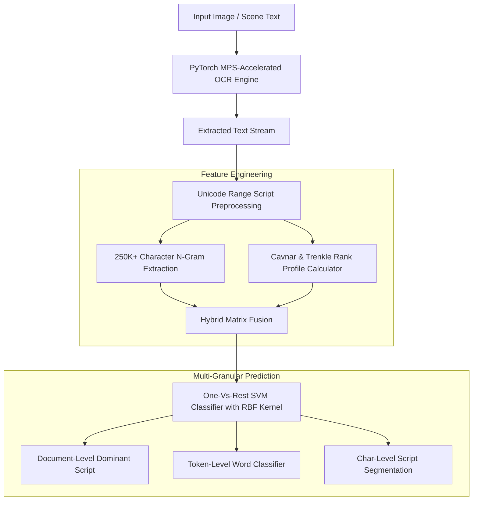

#  Multilingual OCR & Script Identification Engine

[](https://www.python.org/)
[](https://pytorch.org/)
[](https://opencv.org/)
[](https://scikit-learn.org/)
[](LICENSE)

A high-performance machine learning pipeline for **Multilingual Optical Character Recognition (OCR)** and **Script/Language Identification** across 7 major world scripts: **Latin, Arabic, Hindi, Bangla, Korean, Japanese, and Chinese**.

Built on top of the **ICDAR MLT-19** benchmark dataset, this project extracts text from complex scene images using GPU-accelerated OCR engines and classifies script/language identity at multiple granularities (**Document-level, Token-level, and Character-window level**) using a novel **Hybrid N-Gram + Cavnar-Trenkle SVM Architecture**.

---

##  Key Features

- **Multi-Engine OCR & Metal Acceleration**: Integrated **EasyOCR** and **Tesseract OCR (Multi-PSM)** powered by PyTorch with **Apple Silicon GPU (MPS)** acceleration for ultra-fast text recognition.
- **7 World Scripts Covered**: Robust support for Latin, Arabic, Hindi (Devanagari), Bangla, Korean (Hangul), Japanese (Kana/Kanji), and Chinese (Hanzi).
- **Novel Hybrid Feature Architecture**: Combines **250,000+ Character/Word N-Gram TF-IDF features** with **Cavnar & Trenkle Out-of-Place Rank-Order Profiles** into a unified high-dimensional feature space.
- **Multi-Granular Identification**:
  - 📄 **Document / Image Dominant Script Detection**
  - 🔤 **Token (Word) Level Language Prediction**
  - 🔍 **Char-by-Char Script Boundary Windowing** for mixed-language texts.
- **High Benchmark Accuracy**: Achieves **97.08% overall image accuracy** and **97.29% segment-level precision**.

---

##  System Architecture & Pipeline



---

##  Methodology & Feature Engineering

### 1. Unicode Range Script Filtering
Raw OCR outputs are passed through script-specific regex boundaries based on Unicode blocks to filter noise and isolate distinct orthographic signals:
- **Latin**: `[a-zA-Z]`
- **Arabic**: `[\u0600-\u06FF]`
- **Hindi (Devanagari)**: `[\u0900-\u097F]`
- **Bangla**: `[\u0980-\u09FF]`
- **Korean (Hangul)**: `[\uAC00-\uD7AF]`
- **Japanese**: `[\u3040-\u309F\u30A0-\u30FF\u4E00-\u9FFF]`
- **Chinese (Hanzi)**: `[\u4E00-\u9FFF]`

### 2. Cavnar & Trenkle N-Gram Profile Matching
The **Cavnar & Trenkle Out-Of-Place distance metric** measures script dissimilarity by comparing ranked frequency profiles of $N$-grams ($N \in [1, 5]$).

The Out-Of-Place distance $D(P_{test}, P_{model})$ between a test text profile $P_{test}$ and a script model profile $P_{model}$ is computed as:

$$D(P_{test}, P_{model}) = \sum_{x \in P_{test}} | \text{rank}_{test}(x) - \text{rank}_{model}(x) |$$

If an $N$-gram in $P_{test}$ does not exist in $P_{model}$, a maximum penalty score ($99,999$) is assigned.

### 3. Hybrid SVM Vector Fusion
We concatenate the raw sparse $N$-gram TF-IDF vector ($251,602$ dimensions) with the 7-dimensional normalized Cavnar distance vector to train a multi-class **One-Vs-Rest Support Vector Machine (SVM)** with an RBF kernel and balanced class weighting.

---

##  Experimental Results

Evaluating on the **ICDAR MLT-19 Benchmark Test Dataset**:

| Metric | Score |
| :--- | :---: |
| **Segment-Level Accuracy** | **97.29%** |
| **Image-Level Mean Accuracy** | **97.08%** ($\pm 7.12\%$) |
| **Image-Level Mean F1-Score** | **94.47%** ($\pm 12.78\%$) |
| **Mixed-Language Image Accuracy** | **96.41%** |

###  Per-Language Accuracy Breakdown


| Language / Script | Accuracy | Primary Factors & Observations |
| :--- | :---: | :--- |
| **Arabic** | **100.00%** | Highly distinct cursive connected script, zero overlap. |
| **Latin** | **100.00%** | Standard ASCII coverage, strong $N$-gram signatures. |
| **Bangla** | **99.06%** | Distinct Bengali script range and top matra bar features. |
| **Hindi** | **95.00%** | Devanagari script features, minor noise from shared symbols. |
| **Chinese** | **92.50%** | High Hanzi coverage across document blocks. |
| **Korean** | **91.80%** | Distinct Hangul syllabic block identification. |
| **Japanese** | **18.18%** | *Challenge Case*: High overlap between Japanese Kanji and Chinese Hanzi. |

###  Segment Confusion Matrix


> **Insights on Japanese Script Recognition:**
> In multilingual OCR datasets, Japanese text frequently contains Kanji characters, which share identical Unicode character codepoints with Chinese Hanzi. Without full contextual sentence modeling, character-level windowing classifies standalone Kanji as Chinese. Resolving this ambiguity is addressed by combining sub-word token context windowing.

---

##  Repository Structure

```
├── ocr_lang_detection.ipynb     # Main Jupyter Notebook (Data Processing, Model Training & Eval)
├── lang_Acc.png                 # Per-language accuracy visualization chart
├── conf_segment_cavnar.png      # Segment-level confusion matrix heatmap
├── final_sunum_443_ocr.pptx     # Project presentation slides
├── 221401014_final_sunum_443_ocr.mp4 # Video demonstration & project walkthrough
└── README.md                    # Project documentation
```

---

## Tech Stack

- **Core Language**: Python 3.10
- **Computer Vision & OCR**: EasyOCR, Tesseract OCR, OpenCV, PIL
- **Machine Learning**: Scikit-Learn (SVM), PyTorch (MPS Accelerated)
- **Data & Feature Engineering**: NumPy, Pandas, CountVectorizer, Regex Unicode Parsing
- **Visualization**: Matplotlib, Seaborn
  
